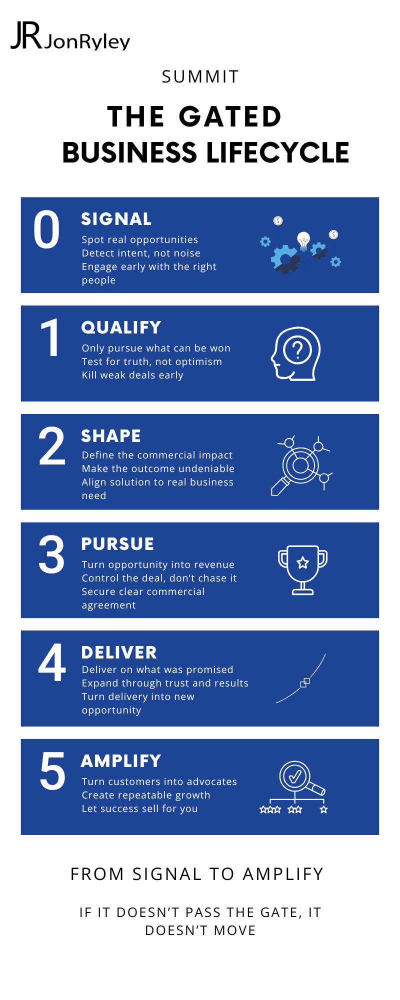

                        

  

# Summit
## The Gated Business Lifecycle

---

Most organisations don’t have a pipeline problem.  
They have a lifecycle problem.

Too many opportunities enter  
Too few are qualified  
Value is unclear  
Execution drifts  
Growth is inconsistent  

Summit solves this.

---

## The Summit Gated Business Lifecycle

**Signal**  
Spot real opportunities  
Detect intent, not noise  
Engage early with the right people  

---

**Qualify**  
Only pursue what can be won  
Test for truth, not optimism  
Kill weak deals early  

---

**Shape**  
Define the commercial impact  
Make the outcome undeniable  
Align solution to real business need  

---

**Pursue**  
Turn opportunity into revenue  
Control the deal, don’t chase it  
Secure clear commercial agreement  

---

**Grow**  
Deliver what was promised  
Prove value in the real world  
Expand through trust and results  

---

**Amplify**  
Turn customers into advocates  
Create repeatable growth  
Let success sell for you  

---

## The Principle

If it doesn’t pass the gate  
It doesn’t move  

---

## What this includes

- A gated commercial lifecycle  
- Clear stage progression  
- Defined decision points (gates)  
- Alignment across sales, delivery, and growth  

---

## Why it matters

Most organisations:

- Confuse activity with progress  
- Carry weak pipeline  
- Lack true visibility  
- Struggle to scale  

Genesis Arc introduces:

- Discipline  
- Clarity  
- Control  
- Predictable growth  

---

## From Signal to Amplify

Structure creates growth  

If it doesn’t pass the gate, it doesn’t move  

---

## Implementation

Most organisations don’t fail because of strategy  
They fail in execution  

Pipeline looks healthy  
Forecasts look strong  
But deals stall, slip, or disappear  

Genesis Arc fixes that  

It introduces structure, discipline, and control across the full commercial lifecycle  

Full implementation includes:

- CRM and pipeline design  
- Qualification frameworks  
- Deal control and progression  
- AI-enabled insight and forecasting  
- Leadership alignment and operating rhythm  

If it doesn’t pass the gate  
It doesn’t move  

For organisations ready to move from activity to outcomes:

👉 https://jonryley.com
